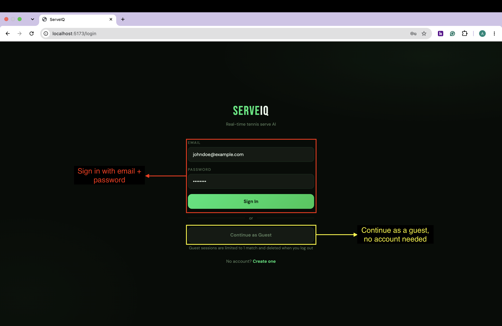
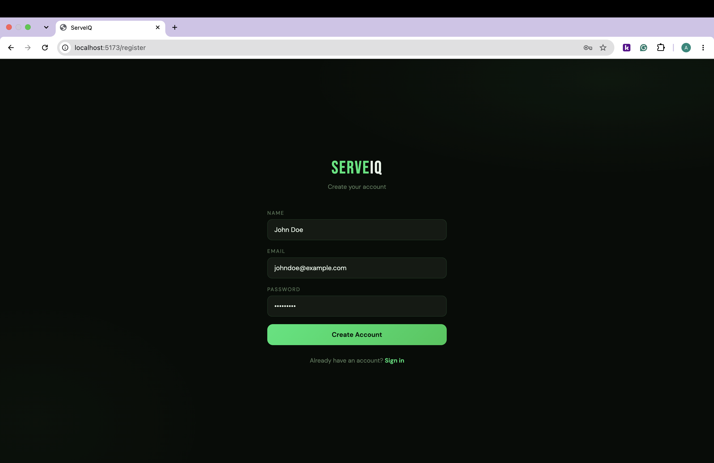
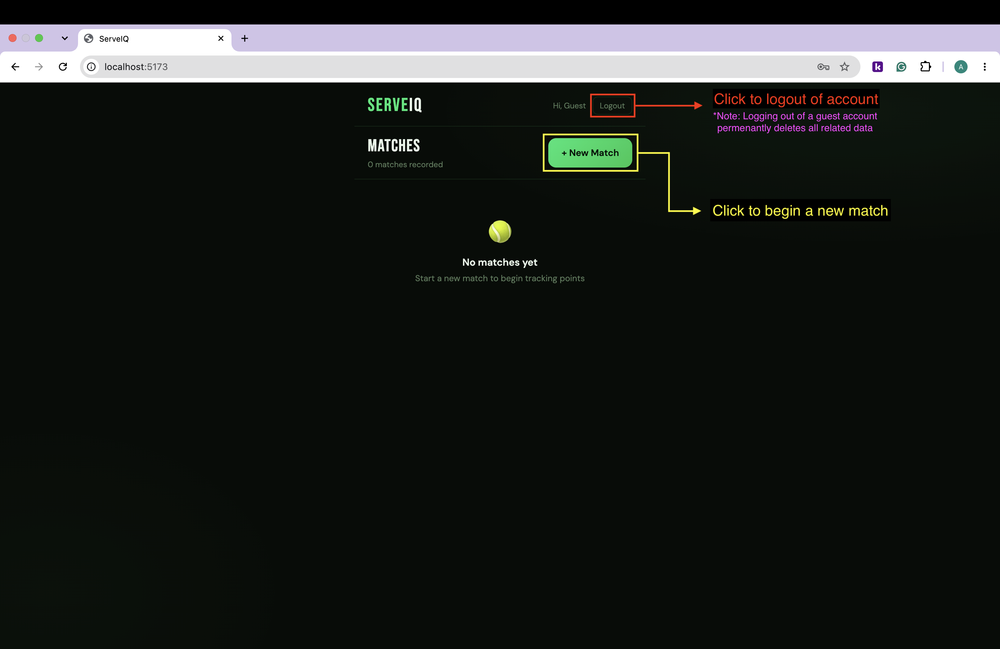
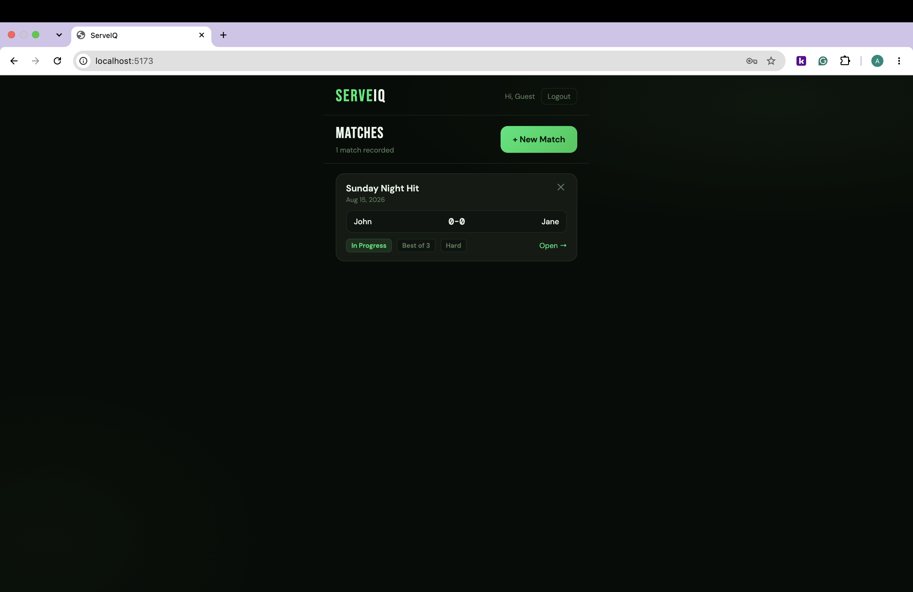
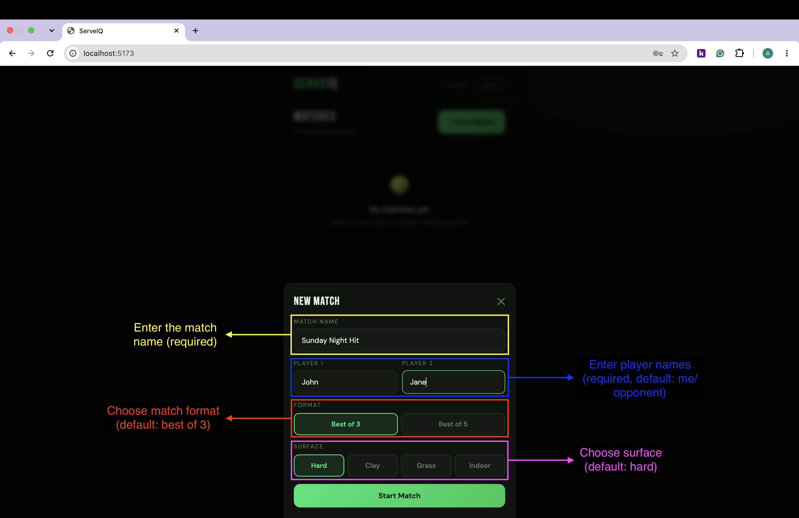
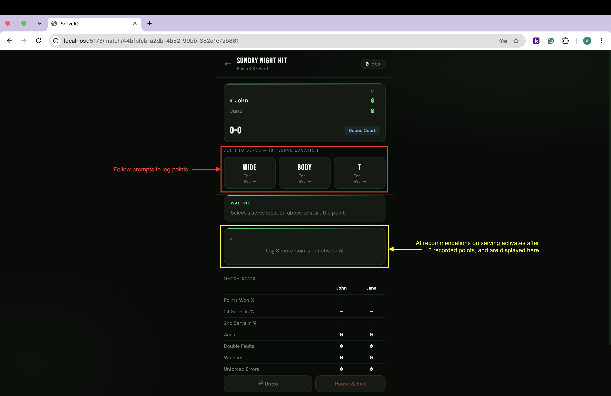
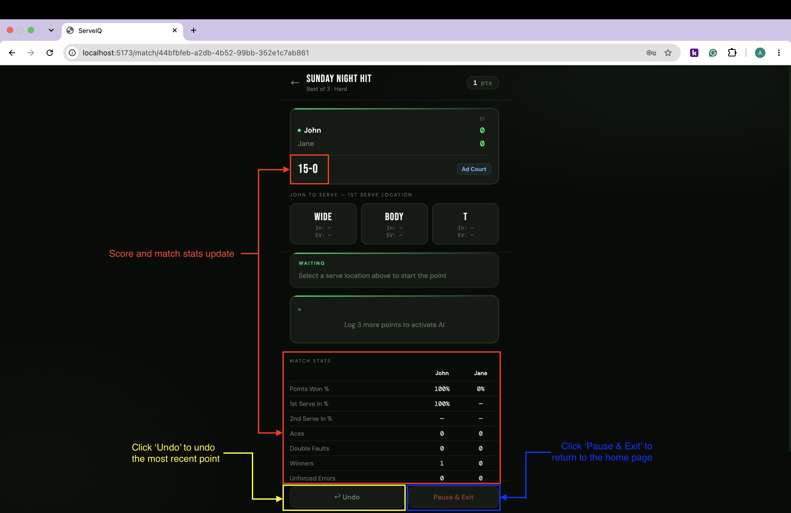
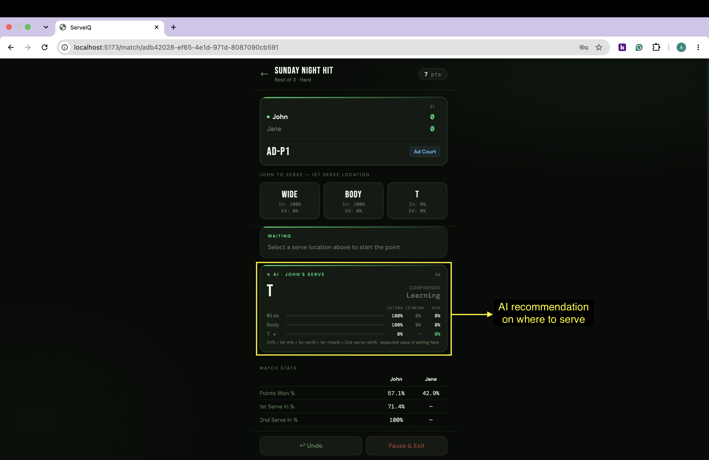

# ServeIQ Website Demo
Example walkthrough of ServeIQ app.

## Creating an Account and Logging In

https://github.com/user-attachments/assets/8e59988d-5704-4939-89cf-4636cbc2becb

### Logging In to the Account
Navigate to the [ServeIQ Login Page.](https://serve-iq-delta.vercel.app/login)

### Creating a New Account
Click _Create One_ on the login page, or go to the [register page.](https://serve-iq-delta.vercel.app/register)

## Creating a New Match
After signing in, you will be navigated to the home page. Here, you can review your matches and create new ones.

### Home Page (Empty)

### Home Page (Matches Saved)

### Creating a Match
In the top right corner of the home page, click _+ New Match_

## Tracking Points

https://github.com/user-attachments/assets/b3083508-1450-41ad-8bc4-dd172d13c619

### Logging a Point

After tracking points, score and statistics will update:

Here's what the system looks like with AI recommendation activated:

